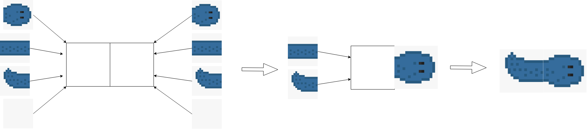
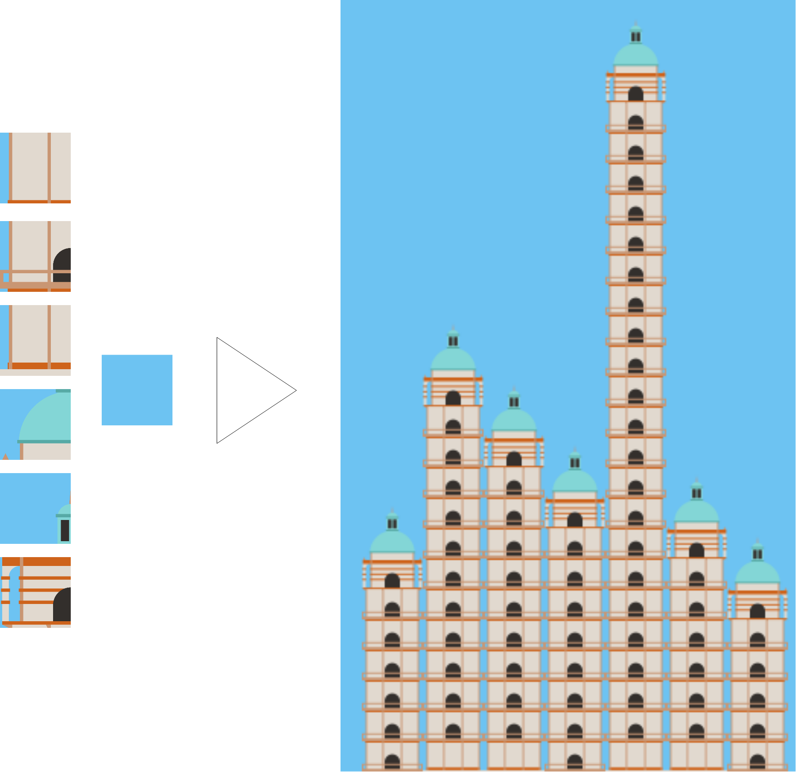

WaveFunctionCollapse implementation in C 
========================================

*This project was based on the [Maxim Gumin's wave function algorithm](https://github.com/mxgmn/WaveFunctionCollapse).*

The program determines a bitmap based on the input consisting of smaller tiles (.png) as well as a set of constraints (.xml). The purpose is to create an image that is [*locally similair*](#Local-Similarity) to the input images.

<p align="center">
  
</p>

## Table of contents

- [Introduction](#introduction)
- [Local similarity](#local-similarity)
- [Algorithm](#algorithm)
- [Possible extensions](#possible-extensions)
- [References](#references)
- [Credits and licences](#credits-and-licences)
- [Documentation](#documentation)
----------------------------------------

## Introduction

The name of the algorithm stems from the Quantum Mechanics, where it refers to a [behaviour](https://en.wikipedia.org/wiki/Wave_function_collapse) of miniscule particles which gradaully determies their position in space. Similair in a broad sense, WaveFunctionCollapse (WFC) determies the orientation and coordinates of input tiles based on initial constraints. Let us consider a simplified example:

1. The bitmap consist of two spaces for tiles, which can be occupied by any of the four tiles with equal propabilities. The *entropy* of each space is 4 now. In our model, the algothim will always choose the minium *non-zero* entropy space and then choose randomly.

2. Let us say that the right space was chosen with a head occupying it. Now only straigt and tail tiles stisfy the neighbourhood rules. The choice of the head tile *propagates* itself throughout the grid.

3. Tail is chosen at random. Valid image is determined, collapse terminates.

<p align="center">
  
</p>

This execution principle is extended for custom tilesets and sizes of grids. Have a look at the image generated by the tiles inspired by [Imperial College London](https://www.imperial.ac.uk/), our home institution:

<p align="center">
  
</p>

As you can probably spot, tiles can be rotated and flipped, the grid does not have to be a squre, any rectangular shape can be specified. 

## Local similarity

This means in principe that:

> Tiles from the tileset built up the image (ideally all tile types are present in the image at least once, subject to constraints).

Authors: [Łukasz Jakubowski](https://github.com/woocashh), [Maciej Kaszlewicz](https://github.com/NaraS91), [Paweł Kroll](https://github.com/skrroll), [Stefan Radziuk](https://github.com/stefanradziuk)

Tile art in graphics/rpg_map is Overworld rpg tileset by Tayoko (licensed under [CC BY-SA 3.0](https://creativecommons.org/licenses/by-sa/3.0/)) available at [opengameart.org/content/overworld-rpg-tileset](https://opengameart.org/content/overworld-rpg-tileset)

## Algorithm

### Input

The input consists of several files separeted into two groups: constraints and images. 

#### Constraints 
Constrains is a single .xml file formatted as the following example:

```xml
<!-- dir = path_to_directory_with_png_files 
     size_x = width
     size_y = height
     -->

<tiles dir="./graphics/huxley_tiles/" size_x="10" size_y="10">
  
  <!-- each tile box follows the same pattern -->
  
  <!-- neccessary arguments
        file = name of the file 
        top/right/bottom/left = string that will be checked for equality, tiles with equal 
          values can be placed next to each other
        -->
  
  <!-- optional arguments -->
  
  <!-- flip: 
    1 - add a vertically flipped tile to the tileset
    2 - add a horizontally flipped tile
    3 - add both of the flips
    -->
  
  <!-- rotate:
    1 - 90 degrees
    2 - 180 degrees
    3 - 270 degrees
    -->
  
  <tile file="sky.png" top="sky" right="sky" bottom="sky" left="sky"/>

  <tile file="qtr_base.png" top="qtr" right="qtr_base" bottom="pavement" left="sky" flip="2"/>
  <tile file="qtr_balcony.png" top="qtr" right="qtr_balcony" bottom="qtr" left="sky" flip="2"/>
  <tile file="qtr_top_balcony.png" top="qtr_1" right="qtr_top_balcony" bottom="qtr" left="sky" flip="2"/>
  <tile file="qtr_dome.png" top="qtr_2" right="qtr_dome" bottom="qtr_1" left="sky" flip="2"/>
  <tile file="qtr_spire.png" top = "sky" right="qtr_spire" bottom ="qtr_2" left="sky" flip="2" rotate = "1"/>

  <!-- optional constrains that set grid space to a particular tile type
    file = name of the file
    x/y - coordinates of the space (origin is upper left!)
    -->
  
  <constraint file="telephone.png" x="3" y ="9"/>
  
</tiles>
```
#### Images
